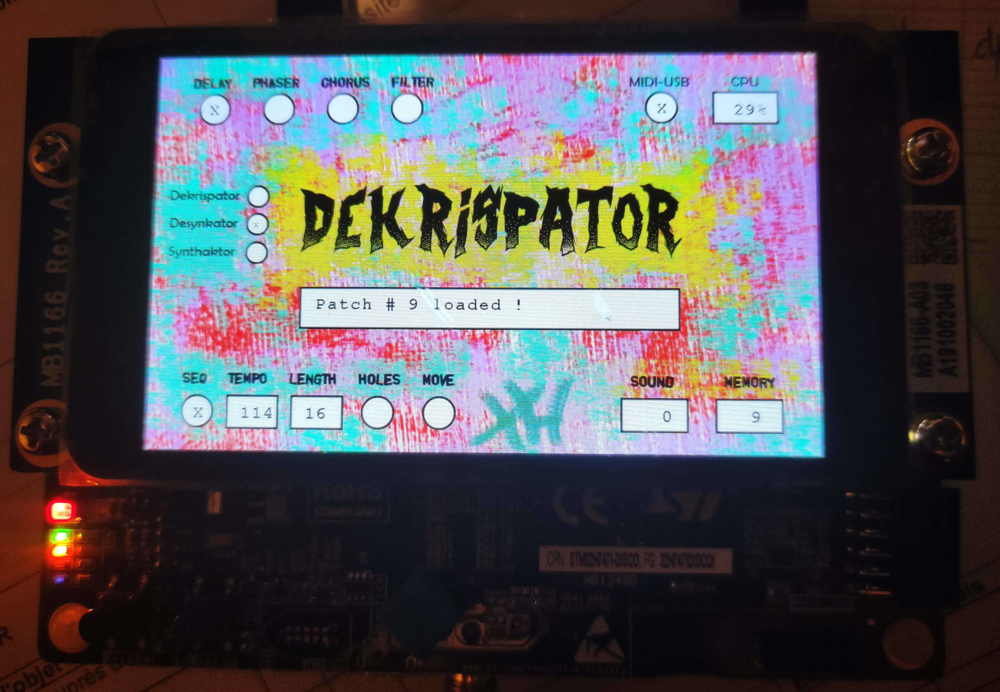

# Dekrispator H747CPP for STM32H747 (C++ version)

----

This is the C++ version of **Dekrispator** synth ported on a powerful dual core mcu development board : *Discovery Kit STM32H747I-DISCO* from STMicroelectronics.  
Actually, it's a mix of C and C++ files but allowing now use of C++ DaisySP lib for example.
There are two additional instruments :  

* **Desynkator** which is like three metronomic sound generators synchronized in rational ratios tempi with adjustable probabilities. It shares the same controls and FX as Dekrispator.  
* **Drumzator** which is a very simple demo of DaisySP percussion modules.  
CC78 and joystick/right enables toggling between the instruments.  

It's an expensive board but I had the opportunity to get one for free but with a damaged LCD, so I could work on a version which would clearly separate USB and audio with the two embedded cores.  
Of course, at that cost (about 100€), maybe a raspberry Pi would be a better option (less hassle with hardware configuration) but it's another universe !

More info on this synth here (project started in 2012 on STM32F407 MCU) : https://github.com/MrBlueXav/Dekrispator_v2/tree/dekrispatorV3

Sound examples for Desynkator :   
https://polymerickblue.bandcamp.com/track/desynkator-i  
https://polymerickblue.bandcamp.com/track/desynkator-ii  
https://polymerickblue.bandcamp.com/track/desynkator-iii  

DaisySP library from Electrosmith is now included.

----

# Technical features :

* Very basic LCD use at the moment, no touch-screen. 
* Joystick up/down controls volume.   
* "wake-up" button freezes/unfreezes evolution of sounds.
* LED information :
	* The red LED lights on when a system error occurs.  
	* The green LED indicates a midi usb device is connected and recognized.  
	* The blue LED indicates midi activity.  

* Patch memory in QSPI Flash (save/load/erase all) : 32 locations currently.
* M4 core (at 200 MHz) manages MIDI USB Host function (stable with my old Korg NanoKontrol !), sends debug infos on UART and LCD, manages patch memory and sends MIDI messages to control M7 core. Use CN1 to connect your midi device.
* M7 core (at 400 MHz) computes sound.      
* No RTOS
* Samplerate is 48kHz and audio samples are 16 bits large.      
* CPU load is displayed (CM7 only).
* Each core communicates through *openAMP* infrastructure and shared memory, small messages are serialized with *Binn* library (probably overkill).    
* MIDI Control Changes definitions are in a table of functions "ControlChangeFunctionsTable[128]" in MIDI_application.c file.
* soundgen.cpp is the main synth file.
* AUDIO_BUFFER_SIZE is defined in audio_play.h file.
* SDRAM is configured and usable.   

* Debug messages sent with virtual com port from STlink (USART1 --> USB CN2).  
		PC Terminal configuration is as follows:   
	      - BaudRate = 115200 baud      
	      - Word Length = 8 Bits     
	      - Stop Bit = 1      
	      - Parity = None      
	      - Flow control = None   
     

I encountered endless issues to make this project work and suffered a lot... ;-)) I hope some people will find it useful and could use it as an audio synth platform !  
It was first a STM32CubeMX project (the only way I found to reach that point) but can't be regenerated now, be careful ! I left the .ioc file for info only.  
Beware ! This is not professional code, it's a hobby for me.

You should be able to import the project in STM32CubeIDE, I think all necessary files are in the repository.  
There are also makefiles in /Release/ folder.   
The background image for LCD (QSPI_Flash/Dekrispator-screen.bin file) should be written in QSPI Flash device with STM32CubeProgrammer application at address *0x97E8 0000* which is 1.5MB before end of memory.
Be sure to power your board with good PSU (> 1.5 A ?) especially with use of a midi controller, I had USB unstabilities because of unsufficient power in my PC plugs!

----

## Dekrispator features :

* monophonic  
* sound generators :  
	* oscillators with very low aliased analog waveforms with superb minBLEP oscillators (thanks to Sean Bolton)  
	* 4 operators basic FM generator  
	* multisaw (several saws with individual "drifters")  
	* 10 sine additive generator  
	* noise  
 * 16 step random sequencer with variable length, transpositions, various scales    
 * 2 parallel filters LP/BP/HP with LFOs   
 * 1 ADSR enveloppe
 * Effects : 
	* vibrato  
	* tremolo  
	* overdrive/distortion  
	* echo  
	* phaser  
	* stereo chorus/flanger  
	* reverb (from DaisySP)   
	
 * random sound and FX patch generator
 	
----

**Special thanks** to many indirect contributers : Sean Bolton, Perry R. Cook and Gary P. Scavone, Gabriel Rivas, Ross Bencina, Julian Schmidt, GaryA, Thorsten Klose, erwincoumans, ElectroSmith/DaisySP, ST, openAMP, Binn

---- 

